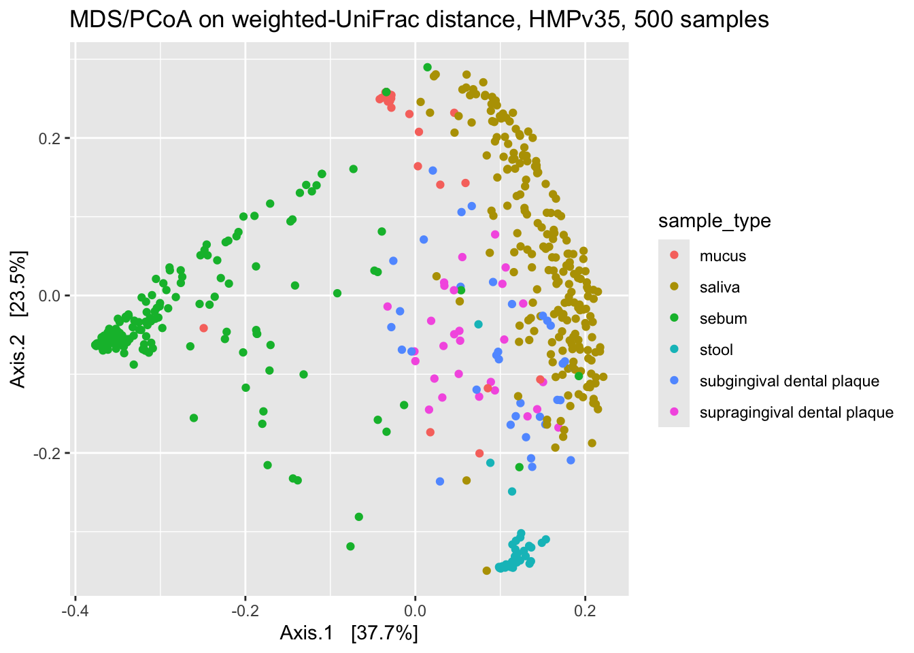

# Clustering Human Microbiome Project (HMP) Data 

## Quick start

Here is my [code for cluster analysis of HMPv35 data](https://rngoodman.github.io/circular-genome-comparisons/circular_genome_comparisons.html) primarily with the [Phyloseq](https://joey711.github.io/phyloseq/) package in R. 

## About 

This workflow takes 16S rRNA data from the human microbiome project (HMP) and primarily uses the Phyloseq package in R to cluster the data and determine if this corresponds to body site i.e. saliva, stool, sebum. The HMPv35 dataset is used which was sequenced from the amplicons of the rRNA 16S variable regions 3-5. 

## Methodologies

### Clustering

#### MDS/PCoA
Multidimensional Scaling/Principle Co-ordinates Analysis 

Strictly an ordination method, MDS/PCoA converts distances among samples into two dimensions, through eigen decomposition, attempting to preserve the original inter-sample distances as best as possible. Thus, samples with the smallest distances between them will cluster closer together on the PCoA graph. The percentage associated with each axis represents the variation accounted for, with the x axis always accounting for greater variation so distance between points in the x axis is greater than distance on the y axis. 

PCoA differs from Principle Components Analysis (PCA) as it converts the correlations among samples, rather than the distances among samples, into a two dimensional graph. The data points are then plotted according to the first two principal components explaining as much of the variation in the data as possible.

#### K-means
The K-means algorithm is a centroid clustering method in that, over a number of iterations, it aims to ensure that within each cluster the observations have the least average dissimilarity from the mean of the cluster. The centre of each cluster is guessed initially and then updated over each iteration until the cluster centres do not change.

#### Hierarchical Clustering
The hierarchical clustering algorithm starts by placing each object into an individual cluster and then combines the clusters most similar to each other iteratively until there is only one cluster, thus the clusters at each level are formed by merging clusters at the lower levels. To perform this the inter-group or inter-cluster dissimilarity can be compared in different ways; complete linkage will compare every sample to the furthest point in each cluster and average linkage will compare every sample to the average of each cluster. When plotted this agglomerative (bottom-up) approach produces a graphical representation of the hierarchy with the terminal nodes all at zero height, called a dendogram

### Distances

#### UniFrac 

UniFrac is a distance metric which takes into account the phylogenetic distances between biological communities in a phylogenetic tree, thus it seeks to explain the evolutionary relationships between species. 

#### Unweighted UniFrac - considers whether a species is present or absent in the phylogenetic tree 
Weighted UniFrac -  takes into account the abundance of species along with the presence within the phylogenetic tree

#### Jaccard
The Jaccard distance measures the dissimilarity between sample sets A and B by calculating 1 - Jaccard similarity coefficient; the intersection of the sample sets divided by union of the sample sets. The Jaccard distance does not consider any phylogenetic distances and is only a measure of dissimilarity.

### Analysis

#### Adjusted Rand Index 
The adjusted rand index is a measure of similarity between two clustering’s adjusted for objects clustering by chance. The closer to 1 the more similar the two clustering’s and the closer to 0 the more dissimilar.

* You can define the percentage identity and length of the comparative site in bp. 
